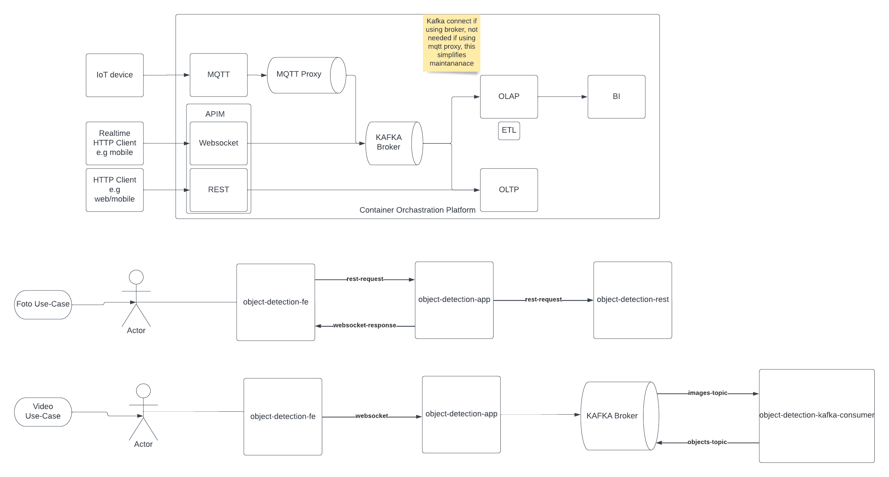

This project demonstrates real time system and data ingestion from object detection (in both video and photo) and sensor data. 
```
just incase, the three directories below are links from;
> https://github.com/rh-aiservices-bu/object-detection-rest
> https://github.com/rh-aiservices-bu/object-detection-app
> https://github.com/rh-aiservices-bu/object-detection-kafka-consumer.git
```
# Architecture



Presumptions
- s2i installed on local
- docker desktop running

to run locally;

## Rest and websocket model inference
```
$ cd object-detection-rest
$ s2i build . registry.access.redhat.com/ubi8/python-38 socrates12345/object-detection-rest:latest
$ docker run -p 8081:8081 --rm -it --name object-detection-rest socrates12345/object-detection-rest:latest
$ docker inspect socrates12345/object-detection-rest | grep IPAddress
```
NOTE! ip address (REST-IPADDRESS) above will be used in the following steps. To test that the rest service has been deployed successfully;
```
$ curl -i -X POST -H "Content-Type: application/json" http://localhost:8081/predictions --data-binary "@sample-requests/twodogs.json"
$cd ../object-detection-app
$ s2i build . registry.access.redhat.com/ubi8/nodejs-14:latest socrates12345/object-detection-app:latest
$ docker run --rm -i -p 8080:8080 -t --env OBJECT_DETECTION_URL=http://{REST_IPADDRESS}:8081/predictions socrates12345/object-detection-app:latest
```
Then to push to docker hub in order to use in kubesphere;
```
$ cd object-detection-rest
$ docker image tag object-detection-rest socrates12345/object-detection-rest:latest
$ docker image push socrates12345/object-detection-rest:latest

$ cd ../object-detection-app
$ docker image tag object-detection-app socrates12345/object-detection-app:latest
$ docker image push socrates12345/object-detection-app:latest
```
NOTE!

both directories include Dockerfile but please note, this is purely for demonstration purposes and is not needed, just to understand what the s2i tool is doing. This can be used as follows;
```
$ cd object-detection-rest
$ docker build -t object-detection-rest:latest .
```
then the run and push commands will be as above. Something is a little weired with the object-detection-app module though, hence strongly recommend using s2i since this is what the compute environment will run anyway, so a closer alignment there.

## Running on Kubernetes

Assumptions;
1. kubernetes is installed and running locally
2. helm locally installed
3. confluent cli locally installed

Steps;
1. to speed up the process, pull images first
2. create deployments

### Pull images

```
> $ docker pull socrates12345/object-detection-app
> $ docker pull socrates12345/object-detection-rest
```

### Create deployments

```
> $ kubectl apply -f object-detection-deployment.yaml
```

then to test;
> $ cd object-detection-app
> $ curl -i -X POST -H "Content-Type: application/json" http://localhost:8080/predictions --data-binary "@sample-requests/twodogs.json"

## Kafka Realtime consumption

Assumptions;

1. kubernetes is installed and running locally
2. helm locally installed
3. confluent cli locally installed

Steps;
1. clear all currently running deployments
2. install confluent
3. build image
4. deploy application

### 1. Clear running deployments

```
$ kubectl delete -f object-detection-deployment.yaml
```
### 2. Install Confluent

```
$ ./create-kafka.sh
```
NOTE! can run the following command to see when all kafka componenets are up
```
$ watch -n 2 -d kubectl confluent status
```
then when all is up
```
$ http://localhost:80/
```
##### Lessons: 
1. for connections you only need the bootstrap_server, consumer_topic, producer_topic
2. always need api_version
3. group_id is what appears in the kafka console
4. the dns name of kafka is <service_name>.<namespace>.svc.cluster.local:9092
    so in this case kafka.confluent.svc.cluster.local:9092

### 3. Build image

```
$ cd object-detection-kafka-consumer
$ git commit -am "on the way"
$ s2i build . registry.access.redhat.com/ubi8/python-38 socrates12345/object-detection-kafka-consumer:latest
```

##### Lessons:
1. unlike when running foto, which uses a restfull endpoint, the video streams websocket to kafka
2. foto will make a http request, but the response comes as a websocket
3. the port forwarding above is for the frontend to be able to get to kubernetes it uses localhost address, not kubernetes FQDN
4. the environment variables for bootstrap_server will be kubernetes dns name while for front end will be localhost
5. go delete the any old images after running s2i above, old images just take space
6. s2i looks at latest commit, so if you make changes and dont commit, it wont work, your changes wont appear

### 4. Deploy application

```
$ kubectl apply -f ../object-detection-deployment-kafka.yaml
```

#### Note! In the deployment above, the container that runs kafka python client needs to be of the same namespace as kafka server, in this case confluent, else networking wont work

to stop everything afterwards;
```
$ kubectl delete -f ../object-detection-deployment-kafka.yaml
```

## Running in cloud

Assumptions;
1. kubernetes cluster already setup on aws with 3 compute nodes each xt3 or larger
2. helm locally installed
3. confluent cli locally installed
4. will run inside kubesphere so need to install that first
5. will create single cluster, but can expand later

### Steps
```
$ ./create-remote-kafka-kubesphere-cluster.sh {nameofakscluster}
```

NOTE!
might need to run 
```
$ chmod +x create-remote-kafka-kubesphere-cluster.sh
```
then to check status of things run;

```
kubectl logs -n kubesphere-system $(kubectl get pod --kubeconfig /Users/socrates/.kube/{nameofakscluster} -n kubesphere-system -l 'app in (ks-install, ks-installer)' -o jsonpath='{.items[0].metadata.name}') -f --kubeconfig /Users/socrates/.kube/{nameofakscluster}
kubectl get svc/ks-console -n kubesphere-system
kubectl edit svc/ks-console -n kubesphere-system --kubeconfig /Users/socrates/.kube/{nameofakscluster}
kubectl logs -n kubesphere-system $(kubectl get pod --kubeconfig /Users/socrates/.kube/$1 -n kubesphere-system -l 'app in (ks-install, ks-installer)' -o jsonpath='{.items[0].metadata.name}') -f --kubeconfig /Users/socrates/.kube/{nameofakscluster}
kubectl confluent status --kubeconfig /Users/socrates/.kube/{nameofakscluster}
```
once the cluster is up, run the edit command above to change Nodeport to LoadBalancer so that you can accessthe ks-console.


for the front end to be able to connect with the confluence cluster will also need

```
$ kubectl port-forward controlcenter-0 9021:9021
```
then go to http://localhost:9021

When everything is up then you can deploy the application to the cluster;
```
kubectl apply -f object-detection-deployment-kafka.yaml --kubeconfig /Users/socrates/.kube/{nameofakscluster}
```

## MQTT integration

### Assumptions
1. conluent cluster is running meaning confluent namespace already exists, else create it
2. kafka-mqtt is running inside the cluster and port 1883 is exposed

### Steps

install mosquito mqtt broker (ony need the publisher since using kafka mqtt proxy)
```
arch -arm64 brew install mosquitto
```

then run mosquito publisher
```
mosquitto_pub -h 0.0.0.0 -p 1883 -t car/engine/temperature -q 2 -m "190F"
```
log into the confluence console and go to topics, search for temperature and you should see the messages coming in

# Enabling JupyterLab
Note! Typically a datascientist would not be connected directly into the production kubenetes instance, but instead would have
their own instance of kubernetes, that can connect to kafka, hence keeping it separate here to demonstrate the point


## Steps

1. Start jupyter docker container
```
docker run -it --rm -p 8888:8888 -e GRANT_SUDO=yes --user root jupyter/tensorflow-notebook
```
2. Copy source code to running container
```
docker ps
```
Find cid of tensor flow container
```
docker cp object-detection-kafka-consumer/ {cid}:/home/jovyan/
```
4. make kafka accessible to docker container through localhost machine

```
kubectl edit svc/kafka-0-internal
```
Change ClusterIP to LoadBalancer

5. Add dns entry into docker container for kafka listner

```
docker exec -it {containerid of tensor flow} /bin/sh
vi /etc/hosts
```
Insert line;
10.0.0.106	kafka-0.kafka.confluent.svc.cluster.local